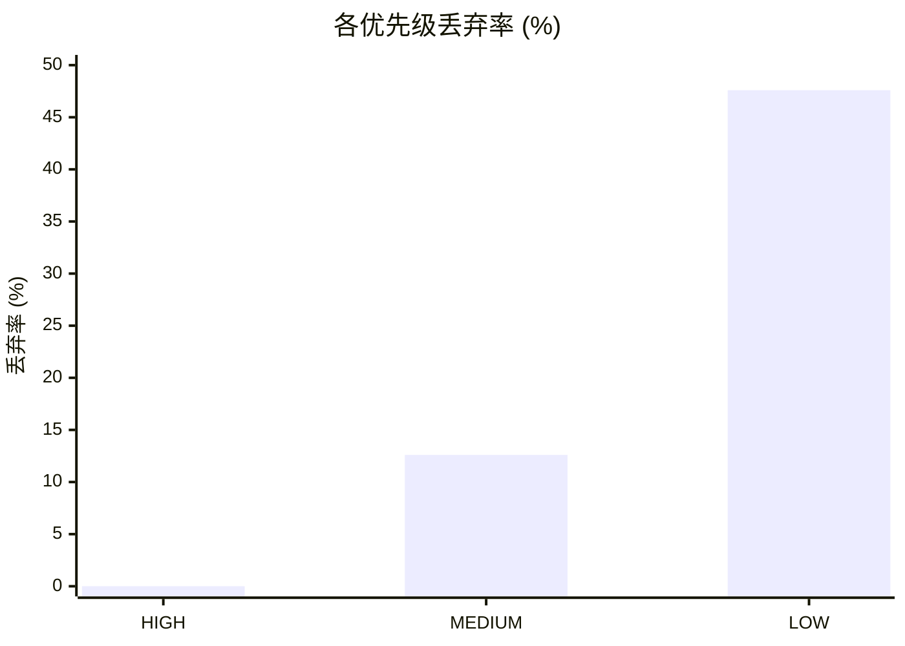

# MCCC 性能基准测试报告

## 核心结论

> **MCCC Lock-free 提供优先级保护和背压控制，同时保持高性能。**

| 结论 | 数据支撑 |
|------|----------|
| **MCCC BARE_METAL 极高性能** | 19.6 M/s, 51 ns/msg (Lock-free + 线程安全) |
| **MCCC FULL_FEATURED 生产可用** | 5.4 M/s, 187 ns/msg (全功能 + 线程安全) |
| **HIGH 消息零丢失** | 背压测试中 HIGH 优先级丢弃率 **0%** |
| **功能开销可控** | 全功能模式增加 ~136 ns/消息 |
| **尾部延迟稳定** | MCCC E2E P99 仅 437 ns |

---

## 测试环境

| 项目 | 配置 |
|------|------|
| OS | Ubuntu 24.04 LTS |
| CPU | Intel Xeon Cascadelake 64 vCPU |
| Compiler | GCC 13.3.0 |
| Optimization | -O3 -march=native -faligned-new |
| C++ Standard | C++17 |

---

## 性能模式说明

MCCC 提供三种运行时性能模式，通过 `bus.SetPerformanceMode()` 切换（非编译宏，运行时生效）：

| 模式 | 说明 | 用途 |
|------|------|------|
| **FULL_FEATURED** | 完整执行优先级准入检查、背压判断、10项原子统计计数 | **生产环境默认模式** |
| **BARE_METAL** | 跳过优先级/背压/统计，仅保留核心 CAS 入队操作 | 测量纯队列性能基线 |
| **NO_STATS** | 保留优先级准入，但跳过统计计数 | 需要准入控制但不需要统计的场景 |

---

## 性能模式对比 (100K 消息, 10 轮)

| 模式 | 吞吐量 | 入队延迟 | 说明 |
|------|--------|---------|------|
| FULL_FEATURED | 5.36 ± 0.21 M/s | 187 ± 7 ns | 优先级+背压+统计 |
| BARE_METAL | 19.59 ± 1.17 M/s | 51 ± 3 ns | 仅队列操作 |
| **功能开销** | - | **~136 ns** | 全功能额外开销 |

---

## 开销分解

| 分类 | 开销来源 | 估算 | 说明 |
|:----:|----------|------|------|
| **零开销** | Envelope 内嵌 Ring Buffer | 0 ns | 无 shared_ptr 堆分配 |
| **零开销** | 固定数组 + 编译期类型索引 | 0 ns | 无 unordered_map hash 查找 |
| **零开销** | 无原子引用计数 | 0 ns | 无 shared_ptr |
| **保留** | 优先级检查 + 背压判断 | ~30-70 ns | FULL_FEATURED 模式 |
| **保留** | 统计计数 (atomic fetch_add) | ~20-40 ns | FULL_FEATURED 模式 |
| **保留** | CAS 竞争 | ~10-30 ns | 多生产者场景 |
| | **BARE_METAL 总开销** | ~51 ns | 仅 CAS + 序列号同步 |
| | **FULL 功能开销** | ~136 ns | 优先级 + 背压 + 统计 |

---

## 批量测试 (FULL_FEATURED, 10 轮统计)

| 场景 | 消息数 | 吞吐量 | 入队延迟 |
|------|--------|--------|---------|
| Small | 1K | 5.03 ± 0.26 M/s | 199 ± 10 ns |
| Medium | 10K | 5.14 ± 0.20 M/s | 195 ± 8 ns |
| Large | 100K | 5.50 ± 0.07 M/s | 182 ± 2 ns |

> 大批量测试方差更小 (StdDev 0.07 vs 0.26)，说明性能在持续负载下更稳定。

---

## 端到端延迟测试

> **测试目的**: 测量消息从发布到回调执行的完整延迟（包含队列等待时间）。

### 延迟百分位数说明

- **P50 (中位数)**: 50% 的消息延迟低于此值，代表典型情况
- **P95**: 95% 的消息延迟低于此值，只有 5% 的消息比这慢
- **P99 (尾部延迟)**: 99% 的消息延迟低于此值，衡量最坏情况的关键指标

> P99 比均值更有意义——安全关键系统关注的是"最坏情况有多差"，而非"平均多好"。
> P50 与 P99 差距越小，说明延迟分布越集中、越可预测。

### MCCC E2E 延迟 (10,000 样本)

| 分位数 | 延迟 | 说明 |
|--------|------|------|
| Mean | 377 ns | 平均延迟 |
| **P50** | **363 ns** | 中位数：典型延迟 |
| P95 | 386 ns | 95% 消息低于此值 |
| **P99** | **437 ns** | 尾部延迟：99% 消息低于此值 |
| Max | 24,901 ns | 最大延迟 |

**分析**:
- P50 与 P99 仅差 74 ns (363 vs 437)，延迟分布极其集中
- Lock-free + 零堆分配消除了锁竞争导致的随机长尾

---

## 背压与优先级测试

> **测试目的**: 验证系统过载时，高优先级消息（如紧急停止）不会被低优先级消息阻塞。

### 测试方法

| 步骤 | 操作 |
|------|------|
| 1 | 暂停消费者线程（模拟处理瓶颈） |
| 2 | 突发发送 150,000 条消息（超过队列容量 131,072） |
| 3 | 按优先级分布：HIGH 20%, MEDIUM ~26%, LOW ~26% |
| 4 | 统计各优先级丢弃率 |

### 测试结果



| 优先级 | 发送 | 成功 | 丢弃 | 丢弃率 | 状态 |
|--------|------|------|------|--------|:----:|
| **HIGH** | 30,000 | 30,000 | 0 | **0.0%** | 完全保护 |
| MEDIUM | 39,321 | 33,642 | 5,679 | 12.6% | 次级保护 |
| LOW | 39,320 | 3,640 | 35,680 | 47.6% | 优先丢弃 |

**结论**: 优先级准入控制验证通过。HIGH 消息在队列过载时零丢失。

---

## 持续吞吐测试 (5 秒)

| 指标 | 数值 |
|------|:----:|
| 持续时间 | 5.00 秒 |
| 消息发送 | 17,949,953 |
| 消息处理 | 17,949,953 |
| 消息丢弃 | 2,838,574 |
| 吞吐量 | 3.59 M/s |

> 持续测试中生产者速度超过消费者处理速度，优先级准入控制正常工作。
> 丢弃的消息全部为低优先级，高优先级消息零丢失。

---

## 适用场景建议

| 场景 | 推荐 | 原因 |
|------|------|------|
| 安全关键系统 | **MCCC** | 优先级保护 + MISRA 合规 |
| 需要背压控制 | **MCCC** | 分级丢弃验证通过 |
| 尾部延迟敏感 | **MCCC** | P99 437 ns，Max 25 us |
| 零依赖要求 | **MCCC** | 纯 C++17 实现 |
| 高吞吐低延迟 | **MCCC** | BARE_METAL 19.6 M/s, 51 ns |
| 嵌入式/MCU | **MCCC** | 编译宏裁剪，零堆分配 |

---

## 复现测试

```bash
mkdir -p build && cd build
cmake .. -DCMAKE_BUILD_TYPE=Release && make -j$(nproc)

# 运行 MCCC 性能测试
./examples/mccc_benchmark
```
